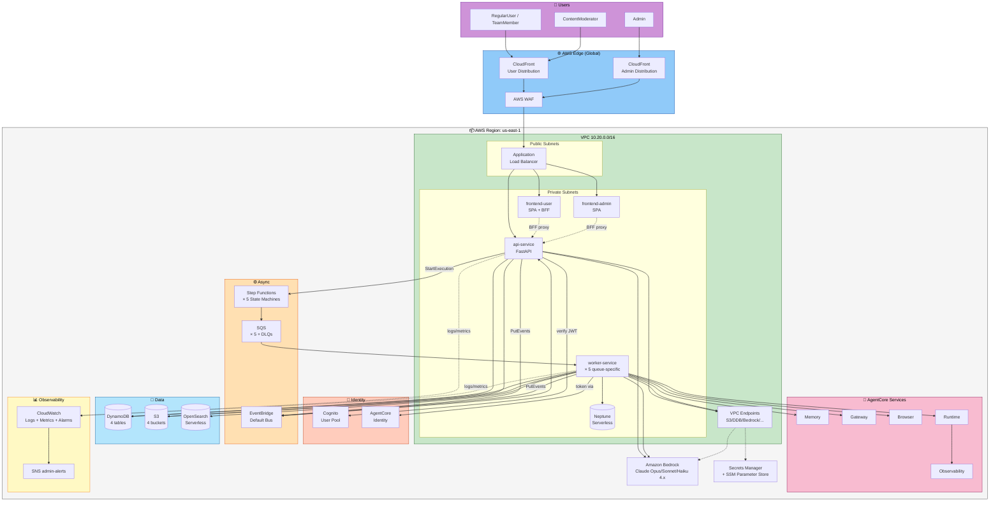
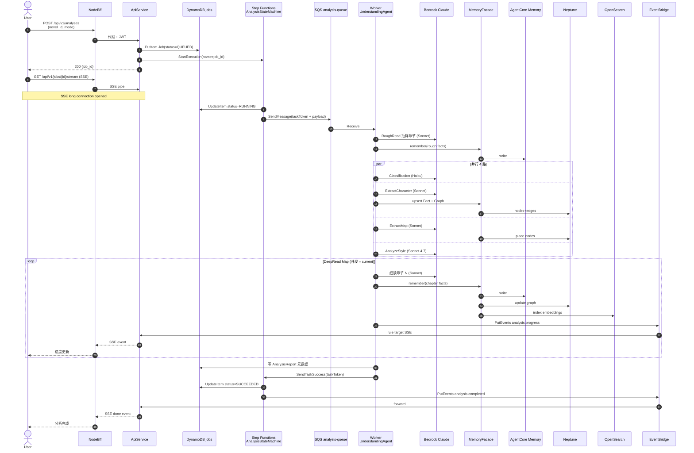
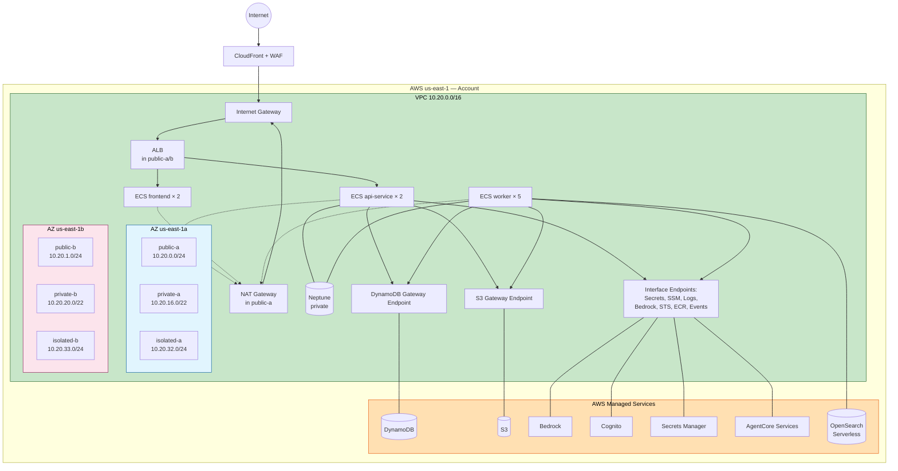
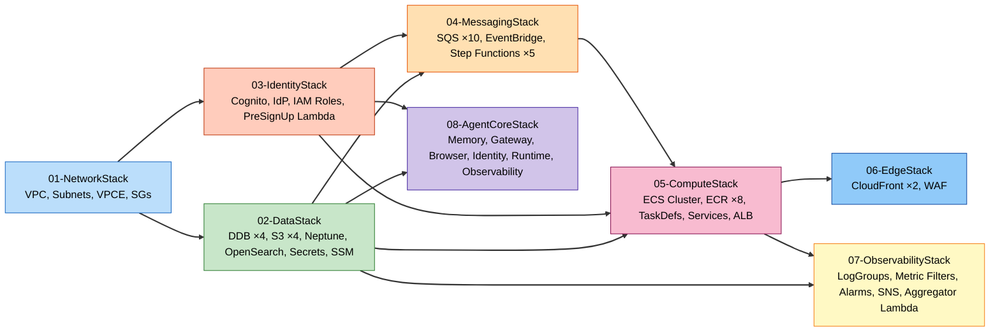

# U1 Deployment Architecture — 架构图集

**Unit**：U1 Platform & Infrastructure
**阶段**：Infrastructure Design
**日期**：2026-04-27
**Figures**: 5 张（系统总览 / 分析数据流 / 生成数据流 / 网络拓扑 / CDK Stack 依赖）

每张图提供 **Mermaid 源** + **ASCII 文本替代**（content-validation.md 要求）。

---

## 图 1：系统总览（High-Level System Architecture）

### 1.1 Mermaid 源



### 1.2 ASCII 文本替代

```
Users -> CloudFront (User / Admin) -> WAF -> ALB (in VPC public subnet)
                                          |
                                          +-> frontend-user (SPA + Node BFF)
                                          +-> frontend-admin (SPA)
                                          +-> api-service (FastAPI)

api-service (FastAPI)
   |-> Cognito (verify JWT)
   |-> DynamoDB (4 tables)
   |-> S3 (4 buckets)
   |-> Step Functions (5 state machines)
   |-> EventBridge (publish)
   |-> Bedrock (direct calls if any)

Step Functions -> SQS (5 queues + DLQs) -> worker-service (5 queue-specific services)
   worker-service
      |-> AgentCore (Memory / Gateway / Browser / Runtime / Observability)
      |-> AgentCore Identity (get workload token)
      |-> Bedrock (Claude Opus/Sonnet/Haiku 4.x via Converse Stream)
      |-> Neptune Serverless (graph)
      |-> OpenSearch Serverless (vectors)
      |-> DynamoDB + S3
      +-> EventBridge (publish job events)

EventBridge --> api-service (SSE endpoint) --> ALB --> CloudFront --> Browser

CloudWatch Logs + Metrics + Alarms -> SNS admin-alerts -> Email
Secrets Manager + SSM Parameter Store -> VPC Endpoints -> Consumers
```

---

## 图 2：分析数据流（Analysis Flow）

### 2.1 Mermaid 源



### 2.2 ASCII 文本替代

```
User                    BFF / API               Step Functions + Worker           Stores
 |                         |                         |                               |
 |--POST /analyses-------->|                         |                               |
 |                         |--PutItem Job(QUEUED)-------------------------------->DDB|
 |                         |--StartExecution------>SFN                              |
 |<-{job_id}---------------|                         |                               |
 |                         |                         |                               |
 |--GET /jobs/{id}/stream->|                         |                               |
 |<=========SSE open=======|                         |                               |
 |                         |                    [SFN RUNNING]                        |
 |                         |                         |--SendMsg w/taskToken-->SQS   |
 |                         |                         |                         |    |
 |                         |                    Worker receives                     |
 |                         |                         |                               |
 |                         |                    RoughRead (Bedrock Sonnet)           |
 |                         |                    Parallel(Classify/Char/Map/Style)    |
 |                         |                    MemoryFacade.remember -------------> AgentCore Memory
 |                         |                    MemoryFacade.upsertGraph ----------> Neptune
 |                         |                         |                               |
 |                         |                    DeepRead Map(concurrency=current)     |
 |                         |                         |--Bedrock calls × N (chapters) |
 |                         |                         |--Memory writes               |
 |                         |                         |--OpenSearch index vectors     |
 |                         |                         |                               |
 |                         |<---PutEvents analysis.progress---EventBridge            |
 |<=====SSE progress event=|                         |                               |
 |                         |                         |                               |
 |                         |                    Worker done --SendTaskSuccess-->SFN  |
 |                         |                    SFN UpdateItem SUCCEEDED --------->DDB|
 |                         |<---PutEvents analysis.completed------EventBridge        |
 |<=====SSE completed======|                         |                               |
```

---

## 图 3：生成数据流（Generation Flow + SSE 流式 + Cancel）

### 3.1 Mermaid 源

```mermaid
sequenceDiagram
    autonumber
    actor User
    participant BFF as NodeBff
    participant API as ApiService
    participant DDB as DynamoDB jobs
    participant SFN as Step Functions<br/>ChapterStateMachine
    participant SQS as SQS generation-queue
    participant GW as Worker GenerationAgent
    participant BR as Bedrock Converse Stream
    participant CR as Worker CriticAgent
    participant MD as Worker ModerationAgent
    participant EB as EventBridge
    participant SSE as SSE endpoint

    User->>BFF: POST /generations (novel_id, mode=CLEAN_ROOM/CONTINUATION)
    BFF->>API: 代理
    API->>DDB: PutItem Generation Job
    API->>SFN: StartExecution outline-workflow
    API-->>User: {gen_id, outline_job_id}
    Note right of API: 大纲生成 (省略)
    User->>API: POST /outline/approve
    API->>SFN: StartExecution chapter-workflow

    loop For each chapter (按大纲)
        SFN->>SQS: SendMessage(chapter N payload)
        SQS->>GW: receive
        GW->>MEM: recall(related facts)
        Note over GW: 构造 prompt<br/>含 Memory 事实 + 风格向量
        GW->>BR: Converse Stream
        loop text_delta 流
            BR-->>GW: token chunk
            GW->>EB: PutEvents generation.chapter.streaming<br/>含 text_delta
            EB->>SSE: rule forward
            SSE-->>BFF: SSE text_delta
            BFF-->>User: 流式显示
            alt cancel_requested?
                GW->>DDB: 检查 Job.cancel_requested
                DDB-->>GW: true
                GW-->>BR: close stream
                GW->>DDB: Update status=CANCELED
                GW->>EB: PutEvents generation.cancel
                break 退出
            end
        end
        GW->>GW: SelfCritique (inline)
        GW->>DDB: Write chapter + self_critique
        GW->>EB: PutEvents generation.chapter.completed
        EB->>CR: rule → critic-queue
        EB->>MD: rule → moderation-queue
        par Critic
            CR->>MEM: recall Facts
            CR->>BR: Critic 评审 (Opus 4.7)
            CR->>DDB: 写 CritiqueReport
            CR->>EB: PutEvents critique_ready
        and Moderation
            MD->>BR: 敏感预标 (Sonnet)
            MD->>DDB: 写 flagged segments
            MD->>EB: PutEvents moderation.flagged
        end
        EB->>SSE: forward
        SSE-->>User: 建议 + 审核提醒
    end

    User->>API: POST /jobs/{id}/cancel (可选中途)
    API->>DDB: UpdateItem cancel_requested=true
    API-->>User: 202
```

### 3.2 ASCII 文本替代

```
User -> POST /generations (mode)
API -> Step Functions (OutlineStateMachine) -> generates outline -> User reviews -> approve
API -> Step Functions (ChapterStateMachine):

  for chapter 1..N:
    SFN -> SQS(generation-queue) -> GenerationWorker
      GW -> MemoryFacade.recall(related facts by chapter context)
      GW -> Bedrock Converse Stream (Sonnet 4.7 默认)
        while token chunks arrive:
          GW -> EventBridge PutEvents 'generation.chapter.streaming' (text_delta)
          EB -> ApiService SSE endpoint -> BFF -> Browser (流式显示)
          GW -> DynamoDB: 检查 Job.cancel_requested?
             if true: close stream, set status=CANCELED, break
      GW -> self-critique (inline with same model)
      GW -> DynamoDB: 写 chapter + self_critique
      GW -> EventBridge: 'generation.chapter.completed'

      parallel:
        Critic:
          CriticAgent -> Bedrock (Opus 4.7) -> CritiqueReport -> DynamoDB
          EventBridge 'critique_ready' -> SSE -> User
        Moderation:
          ModerationAgent -> Bedrock (Sonnet) -> flagged segments -> DynamoDB
          EventBridge 'moderation.flagged' -> SSE -> User / Moderator UI

Cancel:
  User -> POST /jobs/{id}/cancel
  API -> DynamoDB UpdateItem cancel_requested=true
  Worker 轮询检查此 flag，真则关闭 Bedrock stream 并标记 CANCELED。
```

---

## 图 4：网络拓扑（VPC + AZ + Subnets + Endpoints）

### 4.1 Mermaid 源



### 4.2 ASCII 文本替代

```
Internet
   |
   v
CloudFront + WAF (global edge)
   |
   v
Internet Gateway  <---> NAT Gateway (in public-a, single AZ for dev)
   |                         ^
   v                         |
ALB (public-a + public-b)   |
   |                         |
   v                         |
ECS Services (private-a + private-b)
   - frontend-user × 2
   - frontend-admin × 1
   - api-service × 2
   - worker-analysis × 1  ----+
   - worker-generation × 1    |
   - worker-critic × 1        +-> NAT (egress for Bedrock, AgentCore, external)
   - worker-consistency × 1   |
   - worker-moderation × 1    |
                              |
VPC Endpoints (less NAT traffic):
   - S3 Gateway     <-> S3 Buckets
   - DynamoDB Gateway <-> DynamoDB tables
   - Interface: Secrets Manager, SSM, CloudWatch Logs, Bedrock Runtime,
                STS, ECR API/DKR, EventBridge

Neptune Serverless (in private-a, private-b subnets)
OpenSearch Serverless (managed, AOSS endpoint via Interface endpoint)

Subnet CIDR 分配:
  public-a    10.20.0.0/24   (ALB, NAT)
  public-b    10.20.1.0/24   (ALB)
  private-a   10.20.16.0/22  (ECS, Neptune)
  private-b   10.20.20.0/22  (ECS, Neptune)
  isolated-a  10.20.32.0/24  (预留)
  isolated-b  10.20.33.0/24  (预留)
```

---

## 图 5：CDK Stack 依赖图

### 5.1 Mermaid 源



### 5.2 ASCII 文本替代

```
Deployment order (topological):

  Level 0:  01-NetworkStack (VPC, Subnets, VPCE, SGs)
                    |
      +-------------+--------------+
      |                            |
      v                            v
  Level 1:  02-DataStack       03-IdentityStack
            (DDB/S3/Neptune/   (Cognito, IdP,
             OpenSearch/       IAM Roles,
             Secrets/SSM)      PreSignUp λ)
      |        |                   |
      +--------+-------+-----------+
                       |
                       v
  Level 2:  04-MessagingStack (SQS, EventBridge, Step Functions)
                       |
                       v
  Level 3:  05-ComputeStack (ECS Cluster, Services, ALB)
                       |
                       v
  Level 4:  06-EdgeStack (CloudFront × 2, WAF)

  独立叶子（不阻塞前面的部署）:
    07-ObservabilityStack  (depends on DataStack + ComputeStack)
    08-AgentCoreStack      (depends on DataStack + IdentityStack)

部署命令：
  cdk deploy --all              # 全量（~43min）
  cdk deploy --exclusively 05-ComputeStack  # 单栈
  cdk deploy 06-EdgeStack       # 仅 CloudFront
```

---

## 附：图的使用建议

| 图 | 用途 | 阅读场景 |
|---|---|---|
| 图 1 系统总览 | 新成员 onboarding、架构评审 | 首次理解系统 |
| 图 2 分析数据流 | U3 开发、debug 分析任务 | 查看 "分析为何慢" |
| 图 3 生成数据流 | U4/U5 开发、SSE 问题排查 | 章节生成/取消/Critic |
| 图 4 网络拓扑 | 网络/安全问题排查、成本优化 | VPC endpoint 走向、NAT 流量 |
| 图 5 CDK Stack 依赖 | 部署顺序、回滚策略、CI 规划 | 发布前 |

---

## 跨图一致性检查

- **多租户**：图 1-3 中所有数据存储都带 team_id 前缀/命名空间（在 MemoryFacade、StorageAdapter 层保证）
- **AgentCore**：图 1 Agent 调用经 Runtime；图 2-3 细化到各 sub-agent；图 4 Agent 调用走 Interface Endpoint；图 5 AgentCoreStack 单独
- **SSE**：图 1 BFF 中继；图 3 展示完整流式链路；图 4 说明 ALB IdleTimeout 600s；图 5 跨 ComputeStack + MessagingStack
- **Step Functions**：图 1 Async 盒子；图 2-3 具体使用；图 5 MessagingStack
