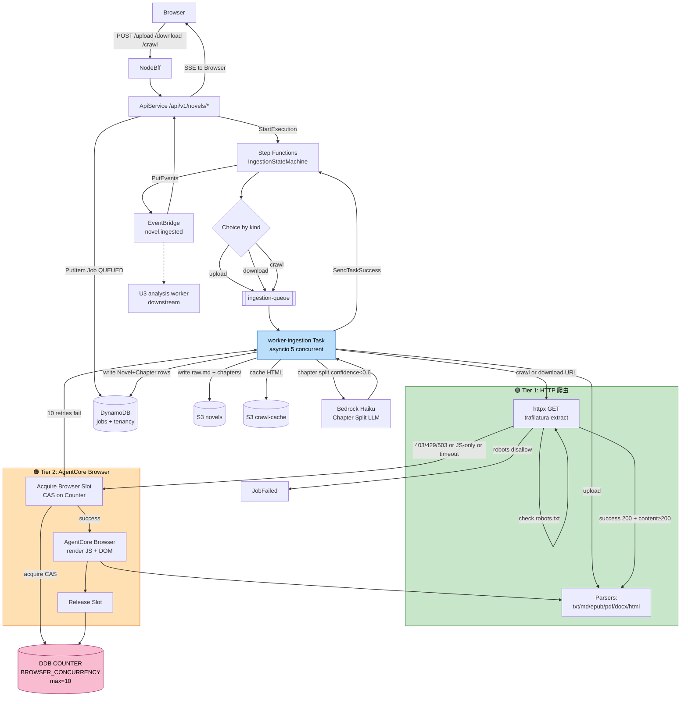
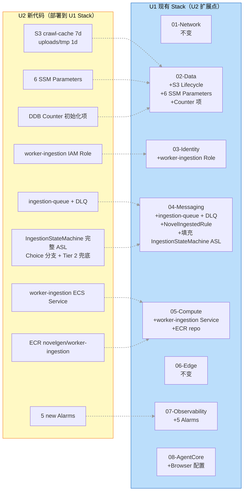

# U2 Deployment Architecture — 架构图集

**Unit**：U2 Ingestion Service
**阶段**：Infrastructure Design
**日期**：2026-04-27
**Figures**: 2 张（U2 数据流 / 扩展 U1 的增量图）

---

## 图 1：U2 数据流（3 触发路径 + 两级 Tier 降级）

### 1.1 Mermaid 源



### 1.2 ASCII 替代

```
Browser → BFF → ApiService → Step Functions IngestionStateMachine
                              │
                    ┌─────────┴─────────┐
                   Choice by payload.kind
                    │         │         │
                 upload    download    crawl
                    └─────────┬─────────┘
                              ▼
                         SQS ingestion-queue
                              ▼
                    worker-ingestion (asyncio 5 concurrent)
                              │
                ┌─────────────┼──────────────┐
                ▼             ▼              ▼
           Parsers:       Tier 1 HTTP     robots.txt
           txt/md/epub/   httpx +         disallow → Fail
           pdf/docx/html  trafilatura
                              │ 403/429/JS-only/timeout
                              ▼
                    Tier 2 AgentCore Browser
                              │ acquire Browser Slot (CAS on DDB COUNTER, max=10)
                              │ render JS + DOM
                              │ release slot
                              ▼
                         Parsers → 章节切分 (启发式)
                              │ confidence < 0.6
                              ▼
                         Bedrock Haiku 辅助
                              ▼
                    ┌────────────────────────┐
                    ▼                        ▼
               S3 raw.md + chapters/    DynamoDB Novel+Chapter
                    │
                    ▼
             S3 crawl-cache (7d TTL, URL hash)
                              ▼
                 SFN SendTaskSuccess → EventBridge novel.ingested
                              ▼
                    ApiService SSE → Browser
                    (未来 U3 analysis worker 订阅)
```

---

## 图 2：扩展 U1 的增量部署图

### 2.1 Mermaid 源



### 2.2 ASCII 替代

```
U1 Stack 层                              U2 新增内容（扩展点）
─────────────────────                   ─────────────────────
01-Network                              (不变)
02-Data                          ←───   S3 Lifecycle: crawl-cache 7d / uploads 1d
                                 ←───   6 SSM Parameters
                                 ←───   DynamoDB COUNTER 初始化项 (Browser=10)
03-Identity                      ←───   worker-ingestion IAM Role
                                        (+ Bedrock/AgentCore/SQS/Events/SSM)
04-Messaging                     ←───   ingestion-queue + DLQ
                                 ←───   NovelIngestedRule (EventBridge)
                                 ←───   填充 IngestionStateMachine ASL
                                        (Choice by kind: upload/download/crawl
                                         + TryBrowserFallback SFN 兜底)
05-Compute                       ←───   worker-ingestion ECS Service
                                        (Fargate SPOT:on-demand=4:1, 1-5 tasks)
                                 ←───   ECR repo novelgen/worker-ingestion
06-Edge                                 (不变)
07-Observability                 ←───   5 new Alarms
                                        (CrawlDowngrade/SearchDowngrade/
                                         BrowserOverused/IngestionTimeoutP95/
                                         RobotsBlockedHigh)
08-AgentCore                     ←───   Browser 会话配置（placeholder 扩展）

单次 cdk deploy --all 增量时间：~8 分钟
```

---

## 图说明

| 图 | 用途 | 阅读场景 |
|---|---|---|
| **图 1** U2 数据流 | 理解 upload/download/crawl 三路径如何走 Tier 1 → Tier 2 | U2 开发、debug 抓取问题 |
| **图 2** 增量部署图 | 理解 U2 对 U1 Stack 的扩展点与 CDK 变更范围 | 发布计划、影响评估 |

---

## 合规关键点（图 1 重点标注）

- **robots.txt disallow → 硬拒绝**（不走 Tier 2）
- **Tier 2 Browser 仍然遵守 robots.txt**
- **Browser 并发硬上限 10**（DDB COUNTER CAS 保障）
- **搜索引擎来源强制 audit**（business-rules R9.2，图中未展开但在 Worker 代码内实现）
