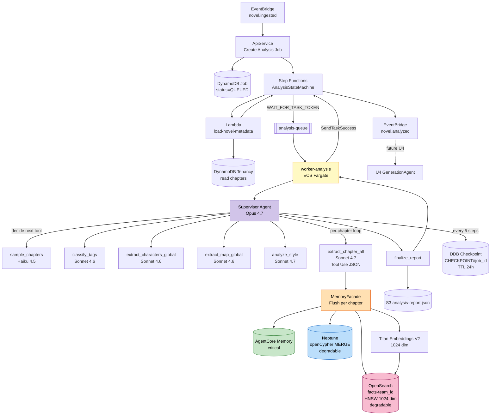
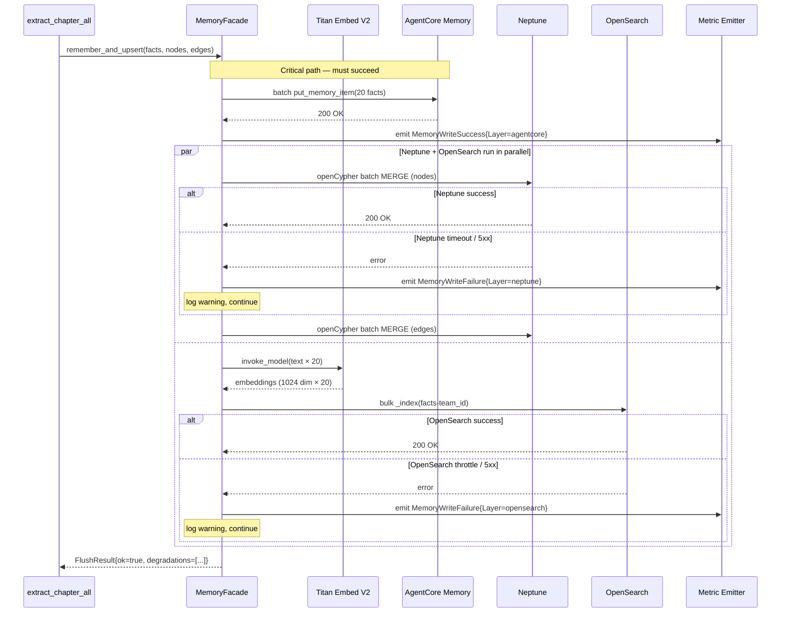
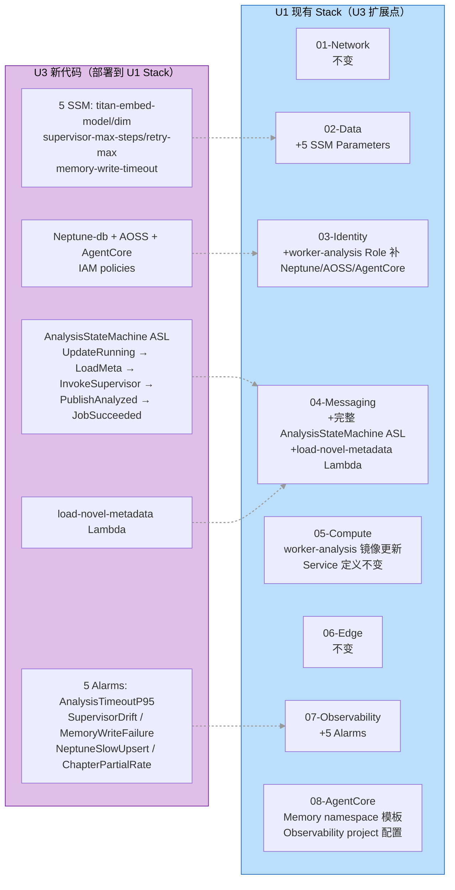

# U3 Deployment Architecture — 架构图集

**Unit**：U3 Understanding Agents
**阶段**：Infrastructure Design
**日期**：2026-04-28
**Figures**: 3 张（U3 数据流 / MemoryFacade 三后端写入 / U3 对 U1 增量）

---

## 图 1：U3 数据流（Supervisor + 6 sub-agent + 三存储后端）

### 1.1 Mermaid 源



### 1.2 ASCII 替代

```
EventBridge novel.ingested → ApiService → DDB Job(QUEUED) → Step Functions AnalysisStateMachine
                                                             │
                                                             ├→ Lambda load-novel-metadata
                                                             │   └→ DDB read chapters
                                                             │
                                                             ├→ SQS analysis-queue (WAIT_FOR_TASK_TOKEN)
                                                             │
                                                             ↓
                                                     worker-analysis Task
                                                             │
                                                             ↓
                                                  Supervisor Agent (Opus 4.7)
                                                             │
                               ┌─────────────────────────────┼────────────────────────┐
                               ↓                             ↓                         ↓
                       sample_chapters (Haiku)     (parallel global analysis)     per-chapter loop
                                                        classify_tags                 │
                                                        extract_chars_global          ↓
                                                        extract_map_global      extract_chapter_all (Sonnet 4.7)
                                                        analyze_style                 (Bedrock Tool Use JSON)
                                                                                      │
                                                                                      ↓
                                                                                MemoryFacade flush
                                                                                      │
                                              ┌───────────────────────────┬──────────┼──────────┐
                                              ↓ (critical)                ↓ (degrad) ↓ (degrad)
                                          AgentCore Memory            Neptune       OpenSearch
                                                                  (openCypher)   (facts-team_id, HNSW)
                                                                                      ↑
                                                                              Titan Embed V2 (1024d)

Every 5 steps: Supervisor → DDB Checkpoint (TTL 24h)
End: finalize_report → S3 analysis-report.json
     SendTaskSuccess → Step Functions → EventBridge novel.analyzed → U4
```

---

## 图 2：MemoryFacade 三后端写入流程（I4=B 新增）

### 2.1 Mermaid 源



### 2.2 ASCII 替代

```
extract_chapter_all → MemoryFacade.remember_and_upsert(facts, nodes, edges)
                         │
                         ├─[1] AgentCore Memory (CRITICAL, must succeed)
                         │      batch put_memory_item(20 facts)
                         │      失败 → raise MemoryBackendError (致命)
                         │
                         ├─[2a] (parallel with 2b) Neptune
                         │      openCypher batch MERGE nodes (Place/Character/Event/Faction)
                         │      openCypher batch MERGE edges (visited/located_in/event_at/belongs_to/rival)
                         │      失败 → warning + emit metric MemoryWriteFailure{Layer=neptune}, 继续
                         │
                         └─[2b] (parallel) OpenSearch
                                Titan Embed V2 (1024d × 20 facts)
                                bulk _index(facts-team_id)
                                失败 → warning + emit metric MemoryWriteFailure{Layer=opensearch}, 继续

                         → FlushResult{ok=true, degradations=[neptune|opensearch|none]}
```

---

## 图 3：U3 对 U1 增量部署图

### 3.1 Mermaid 源



### 3.2 ASCII 替代

```
U1 Stack 层                        U3 新增内容（扩展点）
─────────────────────             ─────────────────────
01-Network                         (不变)
02-Data                     ←───   5 SSM Parameters
                                   (titan-embed-model/dim/supervisor-max-steps/
                                    chapter-retry-max/memory-write-timeout-ms)
03-Identity                 ←───   worker-analysis Role 补齐:
                                   - bedrock-agentcore:InvokeAgent/CreateAgent/
                                     DescribeAgent/PutMemoryItem/GetMemoryItem/
                                     QueryMemory
                                   - neptune-db:ReadDataViaQuery/WriteDataViaQuery
                                   - aoss:APIAccessAll/BatchGetCollection
04-Messaging                ←───   完整 AnalysisStateMachine ASL
                                   (UpdateRunning → LoadMetadata Lambda →
                                    InvokeSupervisor WAIT_FOR_TASK_TOKEN →
                                    PublishAnalyzed EventBridge →
                                    UpdateSucceeded / JobFailed)
                            ←───   load-novel-metadata Lambda
05-Compute                         worker-analysis 镜像更新 (Strands + MemoryFacade)
                                   Service 定义不变
06-Edge                            (不变)
07-Observability            ←───   5 new Alarms
                                   (U3AnalysisTimeoutP95 / SupervisorDrift /
                                    MemoryWriteFailureHigh / NeptuneSlowUpsert /
                                    ChapterPartialRateHigh)
08-AgentCore                ←───   Memory namespace 模板声明
                                   Observability project = novelgen-{env}
                                   (Runtime 注册由 Worker 启动时自注册，I2=C)

预计 cdk deploy --all 增量时间：~4 分钟 (不含 docker push)
```

---

## 图说明

| 图 | 用途 | 阅读场景 |
|---|---|---|
| **图 1** U3 数据流 | 理解 Supervisor 如何编排 6 sub-agent + 三存储 | U3 开发 / debug 分析任务 |
| **图 2** MemoryFacade 写入 | 理解三后端并行 + 分层降级 | Memory 失败排查 / 性能优化 |
| **图 3** U3 对 U1 增量 | 理解 U3 对 U1 Stack 的最小变更范围 | 发布计划 / 影响评估 |

---

## 合规与关键约束（在图中标注）

- **AgentCore Memory 为 critical 层**：失败即 Job FAILED
- **Neptune / OpenSearch 为降级层**：失败仅 warning + metric，业务继续
- **Bedrock Tool Use 强制 JSON schema**：解析失败率接近 0
- **Supervisor 50 步上限** + **每 5 步 checkpoint**：防止 Opus 决策飘移 / Spot 回收损失
- **多租户三层过滤**：Memory namespace + Neptune team_id property + OpenSearch filter
