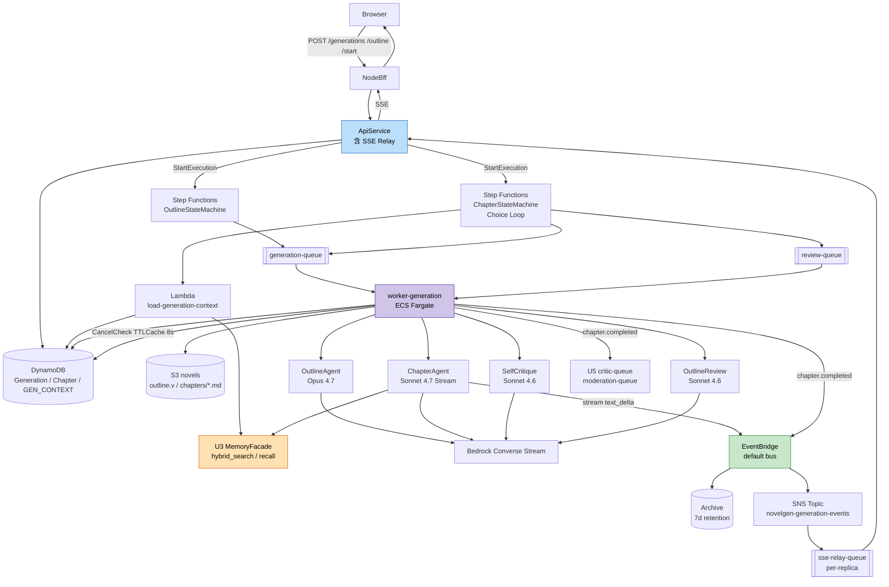
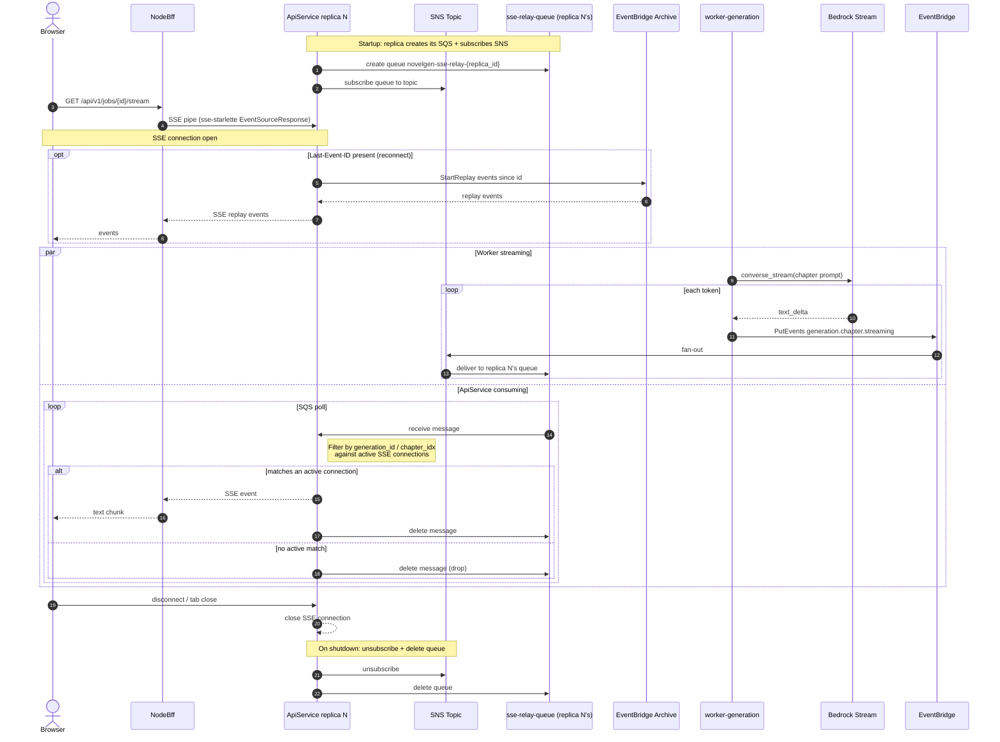
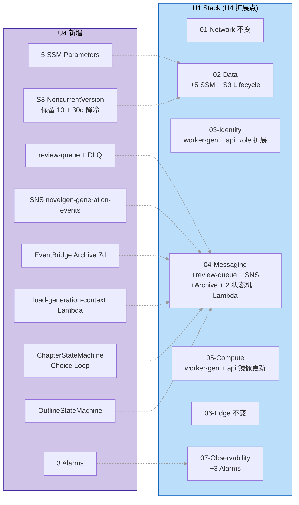

# U4 Deployment Architecture — 架构图集

**Unit**：U4 Generation Agents
**阶段**：Infrastructure Design
**日期**：2026-04-28
**Figures**: 3 张（U4 生成数据流 / SSE 事件流时序图 / U4 对 U1 增量图）

---

## 图 1：U4 生成数据流

### 1.1 Mermaid 源



### 1.2 ASCII 文本替代

```
Browser → NodeBff → ApiService
  ├─ POST /generations → DDB Generation(DRAFT)
  ├─ POST /outline → Step Functions OutlineStateMachine → generation-queue → worker-generation
  │                  → OutlineAgent (Opus 4.7) → S3 outline.v1.json → EventBridge outline.ready
  ├─ PUT /outline (edit) → DDB + review-queue → worker-generation → OutlineReviewAgent (异步建议)
  ├─ POST /outline/approve → DDB status=APPROVED
  ├─ POST /start → Step Functions ChapterStateMachine (Choice Loop + Cancel 检查)
  │     ├─ load-generation-context Lambda → MemoryFacade.hybrid_search → DDB GEN_CONTEXT (24h TTL)
  │     └─ 对 i=1..chapter_count 串行：
  │           GenerateChapter (SQS WAIT_FOR_TASK_TOKEN) → worker-generation
  │             → ChapterAgent (Sonnet 4.7 Converse Stream)
  │             → 每 token: 读 cancel_requested (TTLCache 8s) + 发 text_delta 到 EventBridge
  │             → 完成: 写 S3 chapters/{idx:05d}.md + DDB Chapter + SelfCritique 异步 + 发 chapter.completed
  │
  └─ GET /jobs/{id}/stream 或 /generations/{gid}/chapters/{n}/stream (SSE)
        → sse-starlette EventSourceResponse
        → 订阅 per-replica sse-relay-queue (SNS fan-out 来源)
        → 匹配 generation_id/chapter_idx filter → 转发给 Browser
        → 断线: 用 Last-Event-ID 从 EventBridge Archive 回放

Cancel:
  POST /jobs/{id}/cancel → DDB cancel_requested=true
  Worker 下一个 Bedrock token 回调读 TTLCache 过期 → 查 DDB → 为 true 关 stream → status=CANCELED
  ApiService SSE 发 canceled 事件

派发 U5:
  chapter.completed → EventBridge Rule → critic-queue + moderation-queue
```

---

## 图 2：SSE 事件流时序图（I4=B 新增）

### 2.1 Mermaid 源



### 2.2 ASCII 文本替代

```
Startup (per ApiService replica):
  replica → SQS create queue novelgen-sse-relay-{replica_id}
  replica → SNS subscribe topic

Client connects:
  Browser → NodeBff → ApiService (sse-starlette EventSourceResponse)
  [optional] Last-Event-ID → EventBridge Archive StartReplay → replay to client

Live flow (parallel):
  Worker:   Bedrock converse_stream → per-token EventBridge PutEvents
            → SNS fan-out → every replica's SQS
  ApiService: SQS poll → filter by generation_id/chapter_idx matching active SSE conns
                       → SSE send or drop → delete from SQS

Disconnect:
  Client close → ApiService close SSE connection

Shutdown (per replica):
  SNS unsubscribe → delete SQS queue
```

---

## 图 3：U4 对 U1 增量图

### 3.1 Mermaid 源



### 3.2 ASCII 文本替代

```
U1 Stack                          U4 新增
─────────────                    ─────────────
01-Network                       (不变)
02-Data                  ←────   5 SSM Parameters
                         ←────   S3 Lifecycle NoncurrentVersionExpiration (保留 10 + 30d 降冷)
03-Identity              ←────   worker-generation Role 扩展（aoss/neptune-db/events）
                         ←────   ApiService Role 扩展（sns:Subscribe/Unsubscribe + sqs:Create/DeleteQueue）
04-Messaging             ←────   review-queue + DLQ
                         ←────   SNS Topic novelgen-generation-events (fan-out 到 per-replica SQS)
                         ←────   EventBridge Archive 7d
                         ←────   load-generation-context Lambda
                         ←────   ChapterStateMachine 完整 ASL (Choice Loop + Cancel 检查)
                         ←────   OutlineStateMachine ASL
05-Compute                       worker-generation 镜像更新 (Outline/Chapter/SelfCritique/OutlineReview agents)
                                 ApiService 镜像更新 (sse-starlette + SNS/SQS 消费协程)
06-Edge                          (不变)
07-Observability        ←────   3 Alarms (TTFT / GenerationSlow / CancelSlow)

cdk deploy --all 增量时间 ~5 min（不含 docker push）
```

---

## 图说明

| 图 | 用途 | 阅读场景 |
|---|---|---|
| **图 1** U4 生成数据流 | 理解 Outline/Chapter/SelfCritique 三条主路径 + SSE 链路 + Cancel 机制 | U4 开发 / debug 生成任务 |
| **图 2** SSE 时序图 | 理解 SNS fan-out 每 replica 独立 SQS 的设计原理 + Archive 重放 | 排查 SSE 断线 / 事件丢失 |
| **图 3** U4 对 U1 增量图 | 理解 U4 对 U1 Stack 的变更范围 | 发布计划 / 影响评估 |

---

## 合规与关键约束

- **串行章节生成**（F8=A）：LoopGuard Choice 保证 MaxConcurrency=1 的效果
- **Cancel 响应 ≤ 10s**（N2=B）：TTLCache 8s + Worker 每 token 检查
- **多 replica SSE**：SNS fan-out + 每 replica 独立 SQS，支持水平扩展
- **Last-Event-ID 回放**：依赖 EventBridge Archive 7 天
