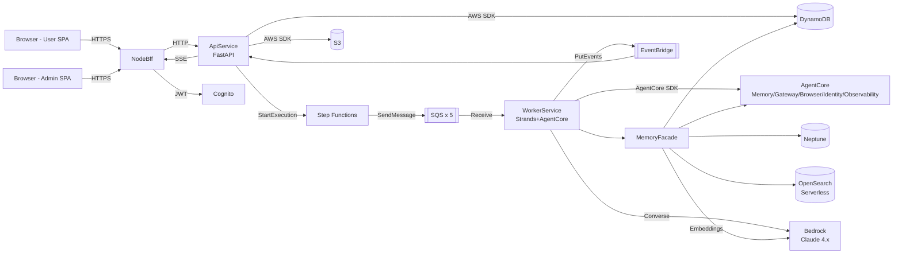

# 组件依赖（Component Dependency）— 小说仿写生成应用

**版本**：1.0
**日期**：2026-04-27

---

## 1. 依赖矩阵

> 行 = 调用方，列 = 被调用方。`✓` = 直接依赖；`△` = 通过事件/异步间接依赖；空 = 不依赖。

|                        | C-01 User | C-02 Admin | C-03 BFF | C-04 Api | C-05 Worker | C-12 Memory | C-13 Workflow | C-15 Auth | C-16 Storage | C-17 Obs | AgentCore | Bedrock | Neptune | OpenSearch | DynamoDB | S3 | SQS | EventBridge |
|---|:-:|:-:|:-:|:-:|:-:|:-:|:-:|:-:|:-:|:-:|:-:|:-:|:-:|:-:|:-:|:-:|:-:|:-:|
| **C-01 Frontend User** |   |   | ✓ |   |   |   |   |   |   |   |   |   |   |   |   |   |   |   |
| **C-02 Frontend Admin**|   |   | ✓ |   |   |   |   |   |   |   |   |   |   |   |   |   |   |   |
| **C-03 NodeBff**       |   |   |   | ✓ |   |   |   | ✓ |   |   |   |   |   |   |   |   |   |   |
| **C-04 ApiService**    |   |   |   |   | △ |   | ✓ | ✓ | ✓ | ✓ |   |   |   |   | ✓ | ✓ |   | △ |
| **C-05 WorkerService** |   |   |   |   |   | ✓ | △ | ✓ | ✓ | ✓ | ✓ | ✓ |   |   | ✓ | ✓ | ✓ | ✓ |
| **C-12 MemoryFacade**  |   |   |   |   |   |   |   |   | ✓ | ✓ | ✓ | ✓ | ✓ | ✓ | ✓ |   |   |   |
| **C-13 Workflow**      |   |   |   |   | △ |   |   |   |   |   |   |   |   |   |   |   | ✓ |   |

**说明**：
- C-05 WorkerService 是重依赖节点（调用几乎所有下游）
- C-12 MemoryFacade 封装三类存储（Memory / Neptune / OpenSearch）+ Bedrock Embeddings
- AgentCore 在 C-05 中为 Agent 运行时 + Gateway + Browser 的调用入口

---

## 2. 通信模式

### 2.1 同步调用（REST/gRPC）

| From | To | Protocol | Purpose |
|---|---|---|---|
| C-01, C-02 → C-03 | | HTTPS | 前端请求 BFF |
| C-03 → C-04 | | HTTP（VPC 内 ALB）| BFF 代理 |
| C-04 → DynamoDB | | AWS SDK | 元数据读写 |
| C-04 → S3 | | AWS SDK / presign | 文件 |
| C-04 → C-13 (Step Functions) | | AWS SDK StartExecution | 触发长任务 |
| C-04 → SSE endpoint | | HTTP long-poll / chunked | 向前端推送事件 |
| C-05 → AgentCore | | AgentCore SDK | Runtime/Memory/Gateway/Browser |
| C-05 → Bedrock | | Converse (Stream) API | LLM 调用 |
| C-12 → Neptune | | HTTPS (Gremlin/openCypher) | 图查询 |
| C-12 → OpenSearch | | HTTPS | 向量检索 |
| C-03 → Cognito | | OIDC | 登录换 token |

### 2.2 异步事件

| From | To | Mechanism | Purpose |
|---|---|---|---|
| C-13 Workflow → SQS | C-05 Worker | SQS | 任务派发 |
| C-05 Worker → EventBridge | C-04 Api (SSE) | EventBridge default bus | 流式事件、状态更新 |
| C-05 Worker → EventBridge | C-04 Api | EventBridge | Chapter 完成通知 |
| C-04 / C-05 → CloudWatch Logs/Metrics | C-17 Obs | CloudWatch | 可观测 |
| C-05 Worker → SNS → Email | User | SNS | 审核打回、大纲就绪通知 |

### 2.3 数据流图（Mermaid）



### 2.4 数据流图（文本替代）

```
Browser ──► NodeBff ──► ApiService ──► [DynamoDB | S3 | Step Functions]
                                        │
                                        ▼
                                  SQS (5 队列) ──► WorkerService
                                                      │
                                                      ├─► MemoryFacade ──► [AgentCore Memory | Neptune | OpenSearch | DynamoDB]
                                                      ├─► AgentCore (Runtime/Gateway/Browser/Identity/Observability)
                                                      ├─► Bedrock Claude 4.x (Converse, Stream)
                                                      └─► EventBridge ──► ApiService(SSE) ──► NodeBff ──► Browser
```

---

## 3. 组件依赖拓扑排序（构建/启动顺序）

以下顺序作为 CDK 部署与 Units 依赖顺序的参考：

```
Level 0: C-15 Auth (Cognito 资源)、C-16 Storage（DynamoDB/S3 基础设施）、C-17 Obs
Level 1: C-12 MemoryFacade 所依赖的 Managed（Neptune, OpenSearch）+ AgentCore 配置
Level 2: C-12 MemoryFacade（library，随 C-05 打包，但其外部资源需先建）
Level 3: C-13 WorkflowOrchestrator（Step Functions 状态机）
Level 4: C-04 ApiService、C-05 WorkerService（ECS Services）
Level 5: C-03 NodeBff、C-01 User SPA、C-02 Admin SPA
Level 6: CloudFront + WAF + DNS
```

---

## 4. 组件与 Unit 映射

| Component | Unit |
|---|---|
| C-15 AuthAdapter | U1 |
| C-16 StorageAdapter | U1 |
| C-17 ObservabilityAdapter | U1 |
| C-13 WorkflowOrchestrator | U1 |
| C-06 IngestionModule | U2 |
| C-07 UnderstandingAgent | U3 |
| C-08 GenerationAgent | U4 |
| C-09 CriticAgent | U5 |
| C-10 ConsistencyAgent | U5 |
| C-11 ModerationAgent | U5 |
| C-01 WebFrontend (User) | U6 |
| C-03 NodeBff | U6 |
| C-04 ApiService | U1 + 业务 Unit |
| C-05 WorkerService | U3+U4+U5 |
| C-12 MemoryFacade | U3 (owner), 被 U4/U5 共用 |
| C-02 WebFrontend (Admin) | U7 |
| C-14 AdminModule | U7 |

---

## 5. 关键通信契约（OpenAPI 摘要）

- **OpenAPI 规范**位于 `api-service/openapi.yaml`（待 Code Generation 阶段生成）
- **事件规范**：所有 EventBridge 事件遵循 `detail-type` + JSON schema（位于 `shared/events/*.schema.json`）
  - `novel.analysis.progress`
  - `novel.analysis.completed`
  - `generation.outline.ready`
  - `generation.chapter.streaming`（含 text_delta）
  - `generation.chapter.completed`
  - `generation.chapter.critique_ready`
  - `generation.consistency.report_ready`
  - `generation.cancel_requested`
  - `moderation.segment.flagged`

---

## 6. 反依赖（禁止调用）

以下是架构层面禁止的反向调用（维护单向数据流）：

| From | To | 原因 |
|---|---|---|
| C-12 MemoryFacade → C-05 WorkerService | | Facade 不调 Worker |
| C-04 ApiService → C-05 WorkerService (同步) | | 必须通过 SQS/Step Functions，不做同步 RPC |
| C-05 WorkerService → C-04 ApiService (同步) | | Worker 通过 EventBridge 通知 |
| C-02 Admin SPA → ApiService（不经 BFF） | | 所有前端必须经 BFF，统一 Cookie/CSRF |
| 业务模块 → 存储服务（直接） | | 必须经 C-16 StorageAdapter（强制多租户守卫）|

---

## 7. 故障隔离（Bulkhead）

- **WorkerService 按队列分组部署**：analysis-worker / generation-worker / critic-worker / consistency-worker / moderation-worker，各自独立 ECS Service，独立 Auto Scaling，避免某类任务积压拖垮其他
- **Bedrock 调用**：按模型分流量桶（Opus / Sonnet / Haiku），避免 Opus 限流波及 Sonnet 任务
- **Neptune 与 OpenSearch**：failover/降级策略在 C-12 MemoryFacade 中实现（见 services.md §服务级容错）

---

## 8. 多租户流动

```
JWT (Cognito) ──► Principal{team_id, user_id, roles}
    │
    ▼
装饰器 @require_team_access 校验请求体中的 team_id
    │
    ▼
StorageAdapter 强制 key 前缀 teams/{team_id}/
    │
    ▼
DynamoDB PK 前缀 TEAM#{team_id}#
    │
    ▼
Neptune property team_id = :tid
    │
    ▼
OpenSearch filter {term: {team_id: tid}}
    │
    ▼
Agent 调用 AgentCore Memory 时，namespace = team_id
```

违反任何一层都会被运行时 assert 拦截并记录 audit。
