# 执行计划（Execution Plan）— 小说仿写生成应用

**日期**：2026-04-27
**项目类型**：新建项目
**深度级别**：详尽

---

## 1. 详细分析摘要 (详细分析摘要)

### 1.1 变更影响评估 (变更影响评估)

| 维度 | 评估 |
|---|---|
| **User-facing changes** | 是 — 全新 Web 应用（React SPA + admin 后台），多页面多流程 |
| **Structural changes** | 是 — 全新架构：前端 SPA + BFF + Python Agent + 6 个 AgentCore 服务 + 多存储 |
| **Data model changes** | 是 — 新增 DynamoDB 表（users, teams, novels, chapters, schemas, jobs, model-configs）+ Neptune 图 + OpenSearch 向量索引 |
| **API changes** | 是 — 全新 REST + SSE API contracts |
| **NFR impact** | 高 — 严格性能（分析<15min、单章<60s）、严格安全（多租户隔离）、成本敏感（Bedrock） |

### 1.2 风险评估 (风险评估)

- **Risk Level**: **高**
- **Rollback Complexity**: Moderate（新建项目，早期回滚简单；生产后需数据迁移）
- **Testing Complexity**: Complex（多 Agent 异步编排 + 长文 LLM 调用 + 多租户权限 + 流式推送）

### 1.3 关键风险点

| # | 风险 | 缓解策略 |
|---|---|---|
| R-1 | Bedrock 调用成本失控 | Observability 跟踪 + 每任务 token 预算护栏 |
| R-2 | 长时任务（小时级分析）失败重启 | Step Functions + 分章节 checkpoint + Memory 幂等写入 |
| R-3 | 多 Agent 并行时的数据竞态 | AgentCore Memory 版本锁 + Event Sourcing |
| R-4 | 多租户数据泄露 | 所有 DynamoDB PK 前缀 teamId + IAM 策略 session tag + S3 prefix 隔离 |
| R-5 | Neptune/OpenSearch 成本 | MVP 可先用 DynamoDB 自建轻量图 + pgvector，后续按需升级（Application Design 阶段决定） |
| R-6 | AgentCore 各服务是否可用（GA 状态/区域支持） | 在 Application Design 阶段校验；必要时降级备选 |

---

## 2. 工作流可视化

### 2.1 Mermaid 流程图

```mermaid
flowchart TD
    Start(["User Request"])

    subgraph INCEPTION["🔵 INCEPTION PHASE"]
        WD["Workspace Detection<br/><b>COMPLETED</b>"]
        RA["Requirements Analysis<br/><b>COMPLETED</b>"]
        US["User Stories<br/><b>EXECUTE</b>"]
        WP["Workflow Planning<br/><b>IN PROGRESS</b>"]
        AD["Application Design<br/><b>EXECUTE</b>"]
        UG["Units Generation<br/><b>EXECUTE</b>"]
    end

    subgraph CONSTRUCTION["🟢 CONSTRUCTION PHASE"]
        FD["Functional Design<br/><b>EXECUTE per-unit</b>"]
        NFRA["NFR Requirements<br/><b>EXECUTE per-unit</b>"]
        NFRD["NFR Design<br/><b>EXECUTE per-unit</b>"]
        ID["Infrastructure Design<br/><b>EXECUTE per-unit</b>"]
        CG["Code Generation<br/><b>EXECUTE per-unit</b>"]
        BT["Build and Test<br/><b>EXECUTE</b>"]
    end

    subgraph OPERATIONS["🟡 OPERATIONS PHASE"]
        OPS["Operations<br/><b>PLACEHOLDER</b>"]
    end

    Start --> WD
    WD --> RA
    RA --> US
    US --> WP
    WP --> AD
    AD --> UG
    UG --> FD
    FD --> NFRA
    NFRA --> NFRD
    NFRD --> ID
    ID --> CG
    CG -.->|Next Unit| FD
    CG --> BT
    BT -.-> OPS
    BT --> End(["Complete"])

    style WD fill:#4CAF50,stroke:#1B5E20,stroke-width:3px,color:#fff
    style RA fill:#4CAF50,stroke:#1B5E20,stroke-width:3px,color:#fff
    style WP fill:#4CAF50,stroke:#1B5E20,stroke-width:3px,color:#fff
    style CG fill:#4CAF50,stroke:#1B5E20,stroke-width:3px,color:#fff
    style BT fill:#4CAF50,stroke:#1B5E20,stroke-width:3px,color:#fff
    style US fill:#FFA726,stroke:#E65100,stroke-width:3px,stroke-dasharray: 5 5,color:#000
    style AD fill:#FFA726,stroke:#E65100,stroke-width:3px,stroke-dasharray: 5 5,color:#000
    style UG fill:#FFA726,stroke:#E65100,stroke-width:3px,stroke-dasharray: 5 5,color:#000
    style FD fill:#FFA726,stroke:#E65100,stroke-width:3px,stroke-dasharray: 5 5,color:#000
    style NFRA fill:#FFA726,stroke:#E65100,stroke-width:3px,stroke-dasharray: 5 5,color:#000
    style NFRD fill:#FFA726,stroke:#E65100,stroke-width:3px,stroke-dasharray: 5 5,color:#000
    style ID fill:#FFA726,stroke:#E65100,stroke-width:3px,stroke-dasharray: 5 5,color:#000
    style OPS fill:#BDBDBD,stroke:#424242,stroke-width:2px,stroke-dasharray: 5 5,color:#000
    style INCEPTION fill:#BBDEFB,stroke:#1565C0,stroke-width:3px,color:#000
    style CONSTRUCTION fill:#C8E6C9,stroke:#2E7D32,stroke-width:3px,color:#000
    style OPERATIONS fill:#FFF59D,stroke:#F57F17,stroke-width:3px,color:#000
    style Start fill:#CE93D8,stroke:#6A1B9A,stroke-width:3px,color:#000
    style End fill:#CE93D8,stroke:#6A1B9A,stroke-width:3px,color:#000
    linkStyle default stroke:#333,stroke-width:2px
```



### 2.2 文本替代表示

```
🔵 INCEPTION PHASE
  [x] Workspace Detection             COMPLETED
  [-] Reverse Engineering             N/A (新建项目)
  [x] Requirements Analysis           COMPLETED
  [ ] User Stories                    EXECUTE
  [x] Workflow Planning               IN PROGRESS
  [ ] Application Design              EXECUTE
  [ ] Units Generation                EXECUTE

🟢 CONSTRUCTION PHASE (每个 Unit 独立循环)
  [ ] Functional Design （逐 Unit）    EXECUTE (for each unit)
  [ ] NFR Requirements （逐 Unit）     EXECUTE (for each unit)
  [ ] NFR Design （逐 Unit）           EXECUTE (for each unit)
  [ ] Infrastructure Design （逐 Unit） EXECUTE (for each unit)
  [ ] Code Generation （逐 Unit）      EXECUTE (ALWAYS)
  [ ] Build and Test                  EXECUTE (ALWAYS)

🟡 OPERATIONS PHASE
  [ ] Operations                      PLACEHOLDER
```

---

## 3. 阶段执行决策 (Phase Execution Decisions)

### 3.1 🔵 INCEPTION PHASE

| Stage | Decision | Rationale |
|---|---|---|
| Workspace Detection | ✅ COMPLETED | 已完成 |
| Reverse Engineering | ⊘ N/A | 新建项目 项目，无现有代码 |
| Requirements Analysis | ✅ COMPLETED | 已完成 |
| **User Stories** | 🟠 **EXECUTE** | 多角色（普通用户/team 成员/admin）+ 多用户流程（上传→分析→配置→生成→审阅→导出）+ 团队协作场景 → 需要故事级分解确保用户体验一致 |
| Workflow Planning | 🟢 IN PROGRESS | 本阶段 |
| **Application Design** | 🟠 **EXECUTE** | 需要定义 7-10 个新组件（Ingestion、Understanding、Memory、Generation、Critic、Consistency、Frontend、BFF、Admin、Observability 等）+ 服务边界 + 组件依赖 |
| **Units Generation** | 🟠 **EXECUTE** | 需要将系统分解为可并行交付的 Unit（前端、BFF、理解 Agent 群、生成 Agent 群、Critic Agent、平台与基础设施），确保构建阶段可高效推进 |

### 3.2 🟢 CONSTRUCTION PHASE (per-unit loop)

| Stage | Decision | Rationale |
|---|---|---|
| **Functional Design** | 🟠 EXECUTE per-unit | 多 Agent 业务逻辑复杂（Prompt 设计、Memory schema、一致性规则），需要详细设计 |
| **NFR Requirements** | 🟠 EXECUTE per-unit | 严格的性能/安全/成本/可观测需求（NFR-1~7），每 Unit 需要选择合适的技术/模式 |
| **NFR Design** | 🟠 EXECUTE per-unit | 需要为 NFR 设计相应的模式：异步编排、缓存、并行、流式、token 预算、多租户隔离 |
| **Infrastructure Design** | 🟠 EXECUTE per-unit | 6 个 AgentCore 服务 + 多存储 + ECS + CloudFront + Step Functions 需要精确的基础设施映射 |
| **Code Generation** | 🟢 EXECUTE ALWAYS | 每 Unit 的代码实现 |
| **Build and Test** | 🟢 EXECUTE ALWAYS | 多 Unit 集成测试、流式 SSE 测试、多 Agent 协同测试 |

### 3.3 🟡 OPERATIONS PHASE

| Stage | Decision | Rationale |
|---|---|---|
| Operations | ⊘ PLACEHOLDER | 保留位置，后续扩展部署与运维工作流 |

---

## 4. 初步 Unit 划分预览 (Preview — 将在 Units Generation 阶段确定)

基于当前需求，初步预计分解为以下 7 个 Unit（**实际划分在 Units Generation 阶段最终确定**）：

| Unit # | 名称 | 范围 |
|---|---|---|
| **U1** | Platform & Infrastructure | AWS CDK 基础设施、Cognito、VPC、ECS、AgentCore 部署脚手架 |
| **U2** | Ingestion Service | 文件上传、格式转换（TXT/EPUB/PDF/DOCX→Markdown）、Browser 下载、URL 抓取 |
| **U3** | Understanding Agents | 类型鉴别、人物提取、地图提取、风格分析、粗读/细读编排、Memory 写入 |
| **U4** | Generation Agents | 大纲生成、章节生成、Self-Critique、流式 SSE 支持 |
| **U5** | Critic & Consistency | 独立 Critic Agent、全局一致性校验 Agent、修订建议输出 |
| **U6** | Frontend (React SPA + BFF) | 所有用户页面、admin 后台、Node.js BFF、SSE 转发、Cognito 集成 |
| **U7** | Admin & Model Config | 类型/模板管理、每任务阶段模型配置、全局监控 |

**依赖关系**：U1 (基础设施) 必须先完成；U2/U3/U6 可并行启动；U4 依赖 U3 的 Memory；U5 依赖 U4；U7 横切依赖 U3+U4+U6。

---

## 5. 估时 (Estimated Timeline)

| 阶段 | 预计会话轮次 |
|---|---|
| User Stories | 1-2 轮 |
| Application Design | 2-3 轮 |
| Units Generation | 1 轮 |
| Per-Unit 设计 + 代码（7 个 Unit × 5 阶段） | 每 Unit 4-6 轮，共 ~30-40 轮 |
| Build and Test | 2-3 轮 |
| **合计** | **~40-50 轮迭代** |

说明：具体轮次取决于用户在每个审批点的修改要求。

---

## 6. 成功标准 (Success Criteria)

### Primary Goal
交付一个完整 V1 的小说仿写生成应用，覆盖所有 FR 与 NFR，部署到 AWS 海外区。

### Key Deliverables
1. 可用的 React SPA + Node.js BFF（ECS Fargate 容器）
2. Python FastAPI 后端 + 完整的 Agent 链路（基于 AgentCore SDK）
3. AWS CDK 基础设施即代码，一键部署
4. 6 个 AgentCore 服务集成（Runtime/Memory/Gateway/Browser/Observability/Identity）
5. 多租户 Cognito 认证与 team 隔离
6. admin 后台（用户/模板/模型配置/监控）
7. 完整的构建与测试套件（单元测试、集成测试、性能测试）

### Quality Gates
- [ ] 所有 FR 1-10 通过功能测试
- [ ] NFR-1 性能指标达成（100 万字分析 < 15 min；单章 < 60 s）
- [ ] NFR-4 多租户隔离通过渗透测试（跨 team 数据访问被拒绝）
- [ ] Observability 展示完整 trace/指标面板
- [ ] CDK 可从零一键部署到新账号

---

## 7. 关键决策点 (Decision Points — 将在后续阶段处理)

| # | 决策 | 阶段 |
|---|---|---|
| D-1 | 知识图谱：Neptune vs DynamoDB 自建 | Application Design |
| D-2 | 向量检索：OpenSearch Serverless vs Aurora pgvector | Application Design |
| D-3 | Admin UI：嵌入主 SPA vs 独立子项目 | Application Design |
| D-4 | 流式推送：SSE vs WebSocket | NFR Design (U6) |
| D-5 | 异步编排：Step Functions vs 纯 SQS worker | Infrastructure Design (U1) |
| D-6 | 细读阶段并发上限（Bedrock 配额约束） | NFR Design (U3) |

---
