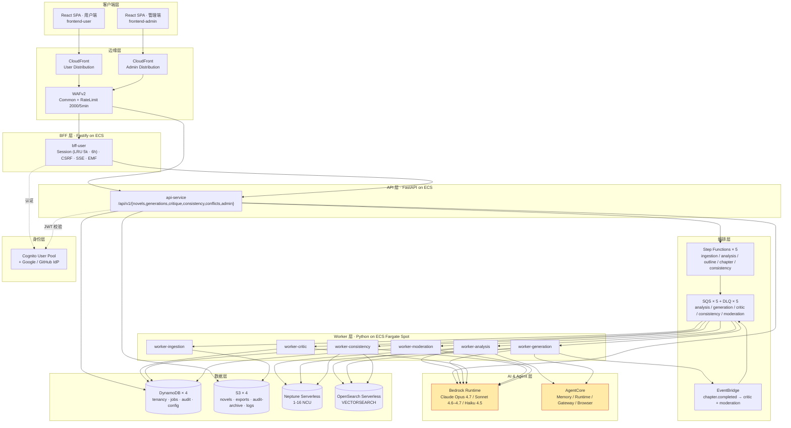
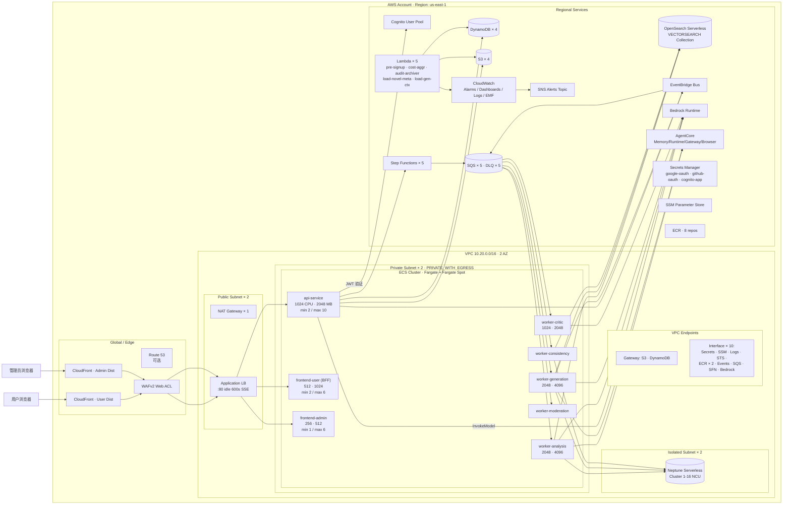
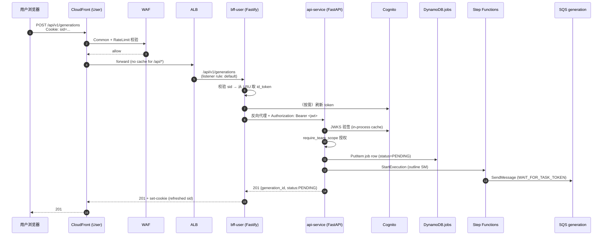
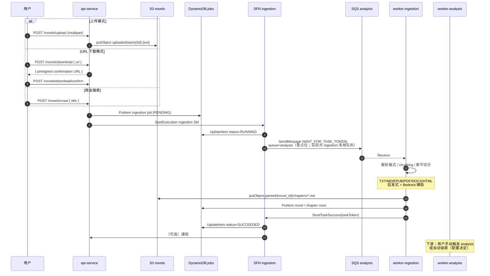
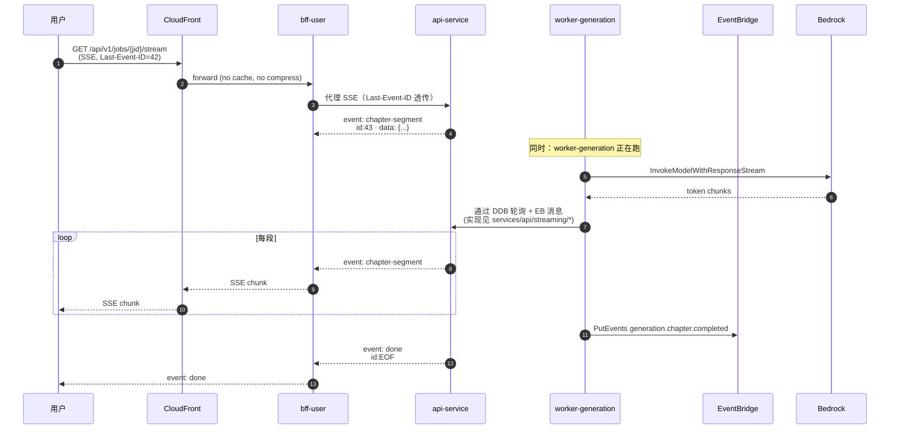
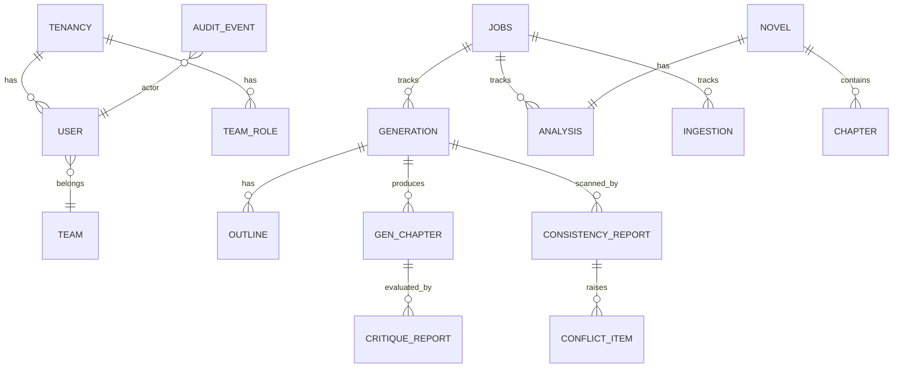
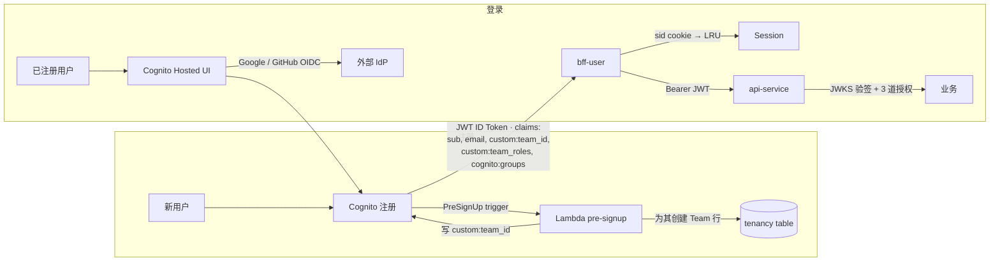
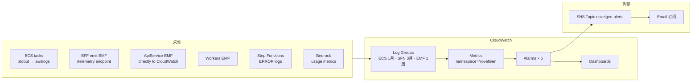

# 架构文档 — 小说仿写生成应用（Novel Generation）

> 本文档取代零散的 U1–U7 设计文档作为**架构视角**的单一入口。实现细节仍以 `aidlc-docs/construction/U[1-7]-*/` 与 `infra/cdk/stacks/*.py` 为准。

## 目录

1. [业务目标与核心流程](#1-业务目标与核心流程)
2. [分层技术架构](#2-分层技术架构)
3. [AWS 资源架构（物理视图）](#3-aws-资源架构物理视图)
4. [服务组件清单](#4-服务组件清单)
5. [信息流 A：用户同步请求](#5-信息流-a用户同步请求)
6. [信息流 B：摄取（ingestion）异步管线](#6-信息流-b摄取ingestion异步管线)
7. [信息流 C：分析 → 生成 → 评审异步管线](#7-信息流-c分析--生成--评审异步管线)
8. [信息流 D：SSE 流式章节生成](#8-信息流-dsse-流式章节生成)
9. [数据模型与存储](#9-数据模型与存储)
10. [身份、授权与多租户](#10-身份授权与多租户)
11. [可观测性与告警](#11-可观测性与告警)
12. [AgentCore 集成](#12-agentcore-集成)
13. [环境隔离与部署拓扑](#13-环境隔离与部署拓扑)
14. [关键架构决策（ADR 摘要）](#14-关键架构决策adr-摘要)

---

## 1. 业务目标与核心流程

**目标**：输入一本完整小说 → 理解其类型 / 人物 / 地图 / 风格 → 让用户配置仿写参数（风格、章节数、每章字数、角色）→ 用 Claude + AgentCore 生成一本全新小说，保证前后一致。

**5 大业务能力**：

| 能力 | 说明 | Unit |
|---|---|---|
| 采集 | 上传 / URL 下载 / 爬虫自动搜索下载 | U2 |
| 理解 | 识别类型（修仙 / 言情 / 穿越 …）、人物、地理、风格 | U3 |
| 生成 | 大纲 → 逐章生成，支持重写 | U4 |
| 评审 | 自动评审（critique） + 一致性（consistency）扫描 | U5 |
| 前端 | 用户端 SPA + 管理端 SPA + BFF | U6 / U7 |

---

## 2. 分层技术架构



**要点**

- **每层都以水平扩展为前提**：CloudFront → ALB → ECS 无状态服务 → SQS 缓冲 → Worker 按队列深度 / CPU 自动伸缩
- **同步请求极短路径**：用户端走 CloudFront → ALB → BFF → ApiService；管理端走 CloudFront → ALB → ApiService（绕开 BFF，由前端 SPA 直接持 Cognito JWT）
- **异步业务全部落在 SQS/SFN**：API 不会阻塞在 LLM 调用上，`SqsSendMessage(WAIT_FOR_TASK_TOKEN)` + Worker `SendTaskSuccess/Failure` 形成闭环
- **写入路径最小权限**：`audit_events` 表由专门的 `audit-write` 角色 put-only，API 通过 `AssumeRole` 临时换取权限，避免主角色能改审计

---

## 3. AWS 资源架构（物理视图）



### 3.1 资源清单速查

| 类别 | 资源 | 数量 | 关键参数 |
|---|---|---|---|
| 网络 | VPC | 1 | 10.20.0.0/16，2 AZ |
| 网络 | NAT Gateway | 1 | （dev 成本优化；prod 建议 × 2） |
| 网络 | Subnet | 6 | Public × 2 + PrivateEgress × 2 + Isolated × 2 |
| 网络 | VPC Endpoint | 12 | Gateway × 2 + Interface × 10 |
| 网络 | Security Group | 5 | ALB / ApiECS / FrontECS / WorkerECS / Neptune |
| 接入 | CloudFront Dist | 2 | user + admin，PriceClass 100 |
| 接入 | WAF Web ACL | 1 | 附 2 个 CloudFront Dist，含 Common + RateLimit（2000/5min/IP）|
| 接入 | ALB | 1 | internet-facing，:80，idle 600s |
| 计算 | ECS Cluster | 1 | ContainerInsights=on，Fargate + Fargate Spot |
| 计算 | ECS Service | 8 | api / frontend-user(BFF) / frontend-admin / 5 个 worker |
| 计算 | ECR Repo | 8 | `novelgen/*`，ImageScanOnPush |
| 计算 | Lambda | 5 | Python 3.12 |
| 身份 | Cognito UserPool | 1 | email 登录，Google+GitHub IdP，PKCE |
| 身份 | Cognito Group | 2 | admin / content_moderator |
| 身份 | IAM Role | 10+ | api-task / worker × 5 / sfn / audit-write / ecs-exec / lambda × N |
| 数据 | DynamoDB Table | 4 | tenancy / jobs / audit / config，全 PAY_PER_REQUEST + PITR |
| 数据 | DynamoDB GSI | 5 | GSI-email / GSI-status / GSI-user / GSI-actor |
| 数据 | S3 Bucket | 4 | novels / exports / audit-archive（ObjectLock）/ logs |
| 数据 | Neptune Cluster | 1 | Serverless 1–16 NCU，IAM Auth，VPC Isolated |
| 数据 | OpenSearch Collection | 1 | VECTORSEARCH |
| 编排 | SQS Queue | 10 | 5 主 + 5 DLQ，主队列 visibility 360s |
| 编排 | EventBridge Rule | 2 | chapter.completed → critic + moderation |
| 编排 | Step Functions SM | 5 | ingestion / analysis / outline / chapter / consistency，超时 6h |
| 配置 | Secret | 3 | google-oauth / github-oauth / cognito-app |
| 配置 | SSM Parameter | 6 | bedrock-region / alert-email / novels-bucket / exports-bucket / aoss-endpoint / neptune-endpoint |
| 观测 | CloudWatch Alarm | 5 | BedrockTokensSpike / DailyTokens / CrossTeamDenied / Api5xx / EcsUnhealthy |
| 观测 | LogGroup | ~15 | ECS × 8（1 月）+ SFN × 5（3 月）+ EMF（1 周）|
| 观测 | SNS Topic | 1 | alerts（邮件订阅）|
| Agent | AgentCore 资源 | 1 Memory + 1 Gateway + 6 GatewayTargets + 5 AgentRuntimes + 1 WorkloadIdentity + 观测 | 由 `infra/cdk/stacks/agentcore_stack.py` 通过 bootstrap Lambda 实际创建（详见 § 12）|

---

## 4. 服务组件清单

### 4.1 React / Node 前端（U6 / U7）

| 组件 | 技术 | 端口 | 职责 |
|---|---|---|---|
| `apps/frontend-user` | React 18 + Vite + TanStack Query + Zustand | 5173 dev | 用户端 SPA：仪表盘、小说库、分析图、大纲审批、章节阅读 |
| `apps/frontend-admin` | 同上 | 5174 dev | 管理端 SPA：用户 / 团队 / 模型配置 / schema / 模板 / 监控 / 审计 / 告警 |
| `apps/bff-user` | Fastify | 3000 | 用户端 BFF：Cognito 会话（LRU 5k × 6h）、CSRF 双提交、SSE 中继（`Last-Event-ID`）、CloudWatch EMF |

### 4.2 Python 服务（U1–U5）

| 服务 | 端口 | 职责 |
|---|---|---|
| `services/api` | 8000 | FastAPI；暴露 `/api/v1/{novels,generations,critique,consistency,conflicts,admin}`；把请求转成 SFN 执行 |
| `services/worker-ingestion` | — | TXT/MD/EPUB/PDF/DOCX/HTML 多解析器；上传 / URL 下载 / 爬虫搜索（遵守 robots.txt）；启发式 + LLM 章节切分 |
| `services/worker-analysis` | — | Opus 4.7 Supervisor + 6 个子 agent：类型识别 / 人物 / 地图 / 风格；写 Memory（AgentCore + Neptune + OpenSearch）|
| `services/worker-generation` | — | Sonnet 4.6–4.7；消费双队列（outline + chapter）；自我评审 + 风格注入；章节完成后发 EventBridge `generation.chapter.completed` |
| `services/worker-critic` | — | Opus 4.7 Tool Use；消费 critic 队列；写 CritiqueReport，发 `critic.report_ready` |
| `services/worker-consistency` | — | Sonnet 4.6 Tool Use；10 章滑窗扫描；写 ConsistencyReport + ConflictItems；DDB 条件更新做幂等 |
| `services/worker-moderation` | — | 内容合规检查（当前仓库无 Dockerfile，见 README 第 16 节）|

### 4.3 Lambda

| 函数 | 触发 | 职责 |
|---|---|---|
| `lambdas/pre-signup` | Cognito PreSignUp | 新用户首次注册时为其自动创建 Team 记录 |
| `lambdas/daily-cost-aggregator` | EventBridge Scheduler（UTC 02:00）| 汇总每日 Bedrock token 消耗（按 Team × Model × Stage）写入 config_table |
| `lambdas/daily-audit-archiver` | EventBridge Scheduler（UTC 03:00）| 把 90 天前的 audit 按天归档为 newline-delimited JSON，存到 `audit-archive` S3（Glacier → Deep Archive）|
| `lambdas/load-novel-metadata` | Step Functions 步骤 | 读取 novels 表返回章节数 / 字数 / 章节标题，供 Analysis SM |
| `lambdas/load-generation-context` | Step Functions 步骤 | 读 Generation 行，向 Memory 混合检索 3 条风格参考，缓存到 `GEN_CONTEXT` 行（24h TTL）|

---

## 5. 信息流 A：用户同步请求

以"创建 generation"为例：



**关键路径耗时目标**（不含 Bedrock 推理）

| 段 | p95 预算 |
|---|---|
| CloudFront → ALB | < 20 ms |
| ALB → BFF | < 5 ms |
| BFF Session/CSRF 处理 | < 10 ms |
| BFF → ApiService | < 5 ms |
| JWT 验签（缓存命中）| < 1 ms |
| DDB PutItem + SFN StartExecution | < 40 ms |
| **端到端（不含推理）** | **< 100 ms** |

**授权 3 道闸**

1. CloudFront 前 WAF（L3/L7 速率 + 通用规则）
2. Cognito JWT 签名 + `custom:team_id` 声明
3. FastAPI `require_team_scope` / `require_admin_role`（跨 team 访问直接 403 并写 audit）

---

## 6. 信息流 B：摄取（ingestion）异步管线



**错误语义**

- SQS 可见性超时 360 s；重试 3 次后进 DLQ（保留 14 天）
- Step Functions 遇到 `Bedrock.ThrottlingException`：2 s 起步，2× 退避，最多 3 次
- Job 状态机（DDB.jobs）：`PENDING → RUNNING → {SUCCEEDED,FAILED}`

---

## 7. 信息流 C：分析 → 生成 → 评审异步管线

这是系统的**主业务链路**：

```mermaid
flowchart LR
  N[Novel 已入库] --> AJ[Analysis Job]
  AJ --> ASFN[SFN analysis]
  ASFN --> ASQS[(SQS analysis)]
  ASQS --> WA[worker-analysis]
  WA -->|Opus 4.7 Supervisor<br/>+ 6 agents| BR1[Bedrock]
  WA -->|角色/地图/事件图谱| NEP[(Neptune)]
  WA -->|chunk embedding| AOSS[(OpenSearch)]
  WA -->|Memory 写入| AC[(AgentCore Memory)]
  WA --> DDB1[(novels.analysis)]

  DDB1 --> GJ[Generation Job · 用户配置风格/章节/字数]
  GJ --> OSFN[SFN outline]
  OSFN --> GSQS[(SQS generation)]
  GSQS --> WG[worker-generation]
  WG -->|Sonnet 4.6/4.7| BR2[Bedrock]
  WG -->|读 Memory + 风格样本| AC
  WG --> DDB2[(generations.outline)]

  DDB2 -->|用户批准大纲| CSFN[SFN chapter · 每章一次 execution]
  CSFN --> GSQS
  GSQS --> WG
  WG -->|逐段流式| BR2
  WG -->|自我评审| BR2
  WG --> S3G[(S3 chapters/{gen_id}/ch_{n}.md)]
  WG --> DDB3[(generations.chapters)]
  WG -->|PutEvents<br/>generation.chapter.completed| EB[EventBridge]

  EB -->|rule 1| CRQ[(SQS critic)]
  EB -->|rule 2| MRQ[(SQS moderation)]
  CRQ --> WC[worker-critic]
  MRQ --> WM[worker-moderation]
  WC -->|Opus 4.7 Tool Use| BR3[Bedrock]
  WC --> DDB4[(critique_reports)]
  WM --> DDB4

  DDB3 --> CSFN2[SFN consistency · 每 10 章扫一次]
  CSFN2 --> CSQ[(SQS consistency)]
  CSQ --> WCO[worker-consistency]
  WCO -->|Sonnet 4.6 Tool Use| BR4[Bedrock]
  WCO -->|读图谱/向量| NEP
  WCO -->|读图谱/向量| AOSS
  WCO --> DDB5[(consistency_reports + conflict_items)]

  classDef store fill:#dfe6e9,stroke:#636e72
  class DDB1,DDB2,DDB3,DDB4,DDB5,S3G,NEP,AOSS store
```

**扇出点**

- `generation.chapter.completed` 事件 → 同一条消息扇出到 **critic** 与 **moderation** 两个队列，保证章节可以并行被评审与审核
- Consistency 每 10 章触发一次，由 DDB 条件更新做序列化，避免同一 generation 跑重复

**反压**

- 队列深度 > 阈值时，SQS 可见性 + worker auto-scale（CPU 70%）联动扩容，最多 5 个 task
- Bedrock 限流由 Step Functions 重试吸收，超过 3 次失败落 DLQ，走告警链路

---

## 8. 信息流 D：SSE 流式章节生成

章节生成是长连接 SSE 的主战场。CloudFront `/api/v1/jobs/*/stream` 路径专门配置 **CACHING_DISABLED + compress=false**（见 `edge_stack.py` 第 99–106 行），ALB idle_timeout 为 600 s。



**断流恢复**：用户端 EventSource 会携带 `Last-Event-ID`，BFF 透传给 ApiService，ApiService 从 `generations.chapters[n].segments[last+1:]` 续发。

---

## 9. 数据模型与存储



### 9.1 DynamoDB 表（4 张，全部 PAY_PER_REQUEST）

| 表 | PK/SK | GSI | 典型项 | 备注 |
|---|---|---|---|---|
| `novelgen_${env}_tenancy` | pk/sk | GSI-email（KEYS_ONLY）| Team / User / TeamRole | 7d PITR；TTL；dev=DESTROY，prod=RETAIN |
| `novelgen_${env}_jobs` | pk/sk | GSI-status（status,created_at）+ GSI-user（owner_user_id,created_at）| Ingestion/Analysis/Generation/Critique/Consistency Job | 状态机 PENDING→RUNNING→{SUCCEEDED,FAILED} |
| `novelgen_${env}_audit` | pk/sk | GSI-actor（actor_user_id,timestamp）| Audit Event | **始终 RETAIN**；仅允许 PutItem；归档到 S3 后不从表里删 |
| `novelgen_${env}_config` | pk/sk | — | 管理端配置：ModelConfig / AnalysisSchema / OutlineTemplate / CostAggregate | 9 阶段模型配置 + optimistic lock |

### 9.2 S3 桶（4 个）

| 桶 | 用途 | 生命周期 |
|---|---|---|
| `novelgen-${env}-novels` | 原始上传 + 章节 Markdown + 章节生成输出 | 版本化 + Intelligent Tiering；90 天删旧版本 |
| `novelgen-${env}-exports` | 用户导出（EPUB / PDF / ZIP）| 30 天过期 |
| `novelgen-${env}-audit-archive` | 归档审计事件 | **Object Lock + 版本化**；90d→Glacier Instant，365d→Deep Archive；始终 RETAIN |
| `novelgen-${env}-logs` | 应用日志（访问日志落点）| 90 天过期 |

### 9.3 Neptune Serverless

角色、地点、事件、派系的**属性图**：

```
(Character)-[:APPEARS_IN]->(Chapter)
(Character)-[:RELATES_TO {type, strength}]->(Character)
(Character)-[:LOCATED_AT {since_chapter}]->(Location)
(Location)-[:CONNECTS_TO {path_type}]->(Location)
(Event)-[:OCCURS_IN]->(Chapter)
(Event)-[:INVOLVES]->(Character)
(Faction)-[:CONTROLS]->(Location)
```

用于 worker-analysis 落图、worker-consistency 判冲突、worker-generation 生成前上下文拉取。

### 9.4 OpenSearch Serverless

`VECTORSEARCH` collection，索引 3 种内容：

- `chunks-${env}`：小说片段向量（1536 维，原著文本切块）
- `facts-${env}`：抽取出的事实卡片（人物 / 地理 / 事件）
- `style-${env}`：风格特征向量（用于风格参考检索）

混合检索（向量 + 关键字）由 `memory-facade` 封装。

---

## 10. 身份、授权与多租户



### 授权三道闸

1. **WAF + CloudFront**：RateLimit 2000 req / 5 min / IP；OWASP 常见规则集
2. **JWT 校验**：Cognito JWKS 在进程内 LRU 缓存；`iss / aud / exp / sub` 全部核对
3. **应用层**：
   - `require_team_scope(team_id)`：比对 JWT 里 `custom:team_id`；不匹配 → 403 + audit
   - `require_admin_role`：必须在 `admin` Cognito Group；单层 RBAC（V1），MFA 强制延后到 V2
   - `audit_events` 的写权限由**独立 IAM Role** `audit-write` 拿（只允许 `dynamodb:PutItem`），API 主 Role 通过 AssumeRole 临时换取，确保审计表不会被主流程误改

### 多租户边界

- Team = 租户最小单位；每个 User 属于且仅属于一个 Team
- Team 内有角色：`owner / editor / viewer`（存在 `custom:team_roles`）+ 全局 `admin / content_moderator`
- 所有业务 DDB 行的 `pk` 都以 `TEAM#{team_id}` 开头；S3 key 也按 `team/{team_id}/...` 前缀
- 跨 team 访问**直接 403** 并写 audit；`CrossTeamDenied` CloudWatch Alarm 阈值 10 次/天

---

## 11. 可观测性与告警



### 5 个告警（ObservabilityStack）

| 名称 | 条件 | 动作 |
|---|---|---|
| `BedrockTokensOutputSpike` | 单次 output tokens > 200k，5 min 窗口 | SNS |
| `BedrockDailyTokens` | 单日 tokens > 500k | SNS（成本保护）|
| `CrossTeamDenied` | 403 跨租户拒绝 > 10 次/天 | SNS（安全告警）|
| `Api5xxRate` | ApiService 5xx 率超阈 | SNS |
| `EcsUnhealthyHosts` | ALB 不健康目标数 > 0 | SNS |

### EMF 自定义指标（NovelGen 命名空间）

- `BedrockErrors`（维度：model_id, env）
- `JobDurationCustom`（维度：job_type, env）
- BFF 的 `sse.connected` / `sse.dropped` / `csrf.blocked` 等

### 分布式追踪

X-Ray 采样在 BFF 和 API 入口打开（当前 SFN 关闭以降成本）。Trace ID 透传：CloudFront → ALB → BFF → ApiService → Worker（通过 SQS 消息 attribute）。

---

## 12. AgentCore 集成

U8 把全部 AgentCore 子服务从 "preview 占位" 升级为 **真实 SDK/API 接入**。所有资源在 CDK 部署阶段通过 `infra/cdk/bootstrap/agentcore_bootstrap/handler.py`（custom resource Lambda，调 `bedrock-agentcore-control` API）创建；运行时代码通过 SSM 参数解析 ID/ARN 后调用 `bedrock-agentcore` data plane。

### 12.1 资源拓扑（dev / prod 各一套）

| 子服务 | 资源 | 命名 | 创建方 | 使用方 |
|---|---|---|---|---|
| **Memory** | 1× Memory + SEMANTIC & SUMMARIZATION 策略 | `novelgen-{env}-memory` | CDK bootstrap Lambda | worker-analysis / worker-generation（通过 MemoryFacade） + 每个 Gateway tool |
| **Gateway** | 1× MCP Gateway + 6× GatewayTarget | `novelgen-{env}-gateway` + `memory-facade / graph-ops / vector-ops / ingestion-fetch / ingestion-browser / ddb-jobs` | CDK bootstrap Lambda | 所有 Agent（通过 GatewayMcpClient） |
| **Runtime** | 5× AgentRuntime | `novelgen-{env}-{supervisor-understanding,supervisor-generation,critic,consistency,moderation}` | CDK bootstrap Lambda | Worker 容器即 AgentRuntime 的 containerUri |
| **Browser** | 0 自建（使用 DEFAULT browser identifier） | — | AWS 默认 | `gateway-ingestion-browser` Lambda + worker-ingestion `tier2_browser.py` |
| **Identity** | 1× WorkloadIdentity | `novelgen-{env}-agent-workload` | CDK bootstrap Lambda | WorkloadIdentityClient（auth-adapter）；作为 Gateway 的 authorizer |
| **Observability** | OTEL sidecar（AgentCore 自动）+ CloudWatch EMF 双写 | — | 容器启动 `init_observability()` | 所有 worker |

### 12.2 SDK 映射速查

| 资源 | Control Plane（创建/更新）| Data Plane（运行时）|
|---|---|---|
| Memory | `CreateMemory`, `UpdateMemory`, `DeleteMemory`, `ListMemories` | `CreateEvent`, `RetrieveMemoryRecords`, `ListEvents` |
| Gateway | `CreateGateway`, `CreateGatewayTarget`, `UpdateGatewayTarget`, `ListGateways`, `ListGatewayTargets` | MCP HTTPS `tools/call` with `Authorization: Bearer <workloadToken>` |
| AgentRuntime | `CreateAgentRuntime`, `UpdateAgentRuntime`, `GetAgentRuntime`, `ListAgentRuntimes` | `InvokeAgentRuntime`（供 Supervisor → Sub-agent 递归调用）|
| Browser | — | `StartBrowserSession`, `StopBrowserSession`, `GetBrowserSession`（+ playwright CDP `connect_over_cdp`）|
| WorkloadIdentity | `CreateWorkloadIdentity`, `GetWorkloadIdentity` | `GetWorkloadAccessToken`, `GetResourceOauth2Token` |

### 12.3 多租户命名

- Memory event `actorId = "{team_id}:{novel_id}"`，`sessionId = "{job_id}"` 或语义 slot（如 `"chapters"`、`"style"`、`"facts"`）。
- Memory strategy `namespaces = ["{actorId}/{sessionId}", "{actorId}"]` 由 CreateMemory 配置固化——所有 RetrieveMemoryRecords 自动按 team+novel 隔离。
- Gateway JWT `sub` 取 Workload token，权限检查由 Gateway 基于 `workloadIdentityAuthorizer` 完成。

### 12.4 SSM 参数契约

部署后 `/novelgen/{env}/agentcore/` 下产出：
- `memory-id` / `memory-arn`
- `gateway-id` / `gateway-endpoint`
- `workload-identity-arn`
- `runtime/{supervisor-understanding,supervisor-generation,critic,consistency,moderation}-arn`

Worker 容器 env 由 CDK 在 `ComputeStack` 中从这些 SSM 读取（或 `AgentRuntime.environment` 直接注入）。

### 12.5 架构简化点（vs preview-placeholder 版本）

- Memory 不再"失败静默跳过"：`AgentCoreMemoryClient.put_batch` 失败 → `MemoryWriteError` → `MemoryFacadeImpl.remember` raise → SQS DLQ。
- `recall()` 主路径走 AgentCore Memory；OpenSearch 仅当 Memory 返回 0 条时兜底。
- Gateway 统一了 Agent→后端的访问口，Worker 容器**不再直连** Neptune/AOSS，只调 Gateway tool；后端 Lambda 封装底层 client。
- AgentCore Runtime 统一承载 Agent 容器生命周期；Worker 启动 `AgentCoreRegistrar` 只做健康检查 + DDB 心跳，不再自己 register。
- Observability 改为 OTEL → AgentCore Runtime sidecar → CloudWatch，原 `emit_metric()` 双写保留以免现有 Alarm 失效。

---

## 13. 环境隔离与部署拓扑

```
dev account                  prod account
├── novelgen-dev-*            ├── novelgen-prod-*
│   ├── VPC 10.20/16          │   ├── VPC 10.30/16
│   ├── NAT × 1               │   ├── NAT × 2（多 AZ）
│   ├── ECR                   │   ├── ECR
│   ├── DDB (DESTROY)         │   ├── DDB (RETAIN)
│   └── CloudFront            │   └── CloudFront + ACM 证书
│
└── CI/CD（GitHub Actions）     └── CI/CD 手动 gate
```

隔离级别：**双账号**（dev / prod），同 region。共享：Bedrock 模型访问（分账号各自开通）、AgentCore preview 白名单。

CDK 内部用环境变量 `NOVELGEN_ENV` 切换，`config.py::load_config()` 统一读取：

```python
env_name = os.environ.get("NOVELGEN_ENV", "dev")
region   = os.environ.get("AWS_REGION",  "us-east-1")
account  = os.environ.get("CDK_DEFAULT_ACCOUNT") or os.environ.get("AWS_ACCOUNT")
vpc_cidr = os.environ.get("NOVELGEN_VPC_CIDR", "10.20.0.0/16")
```

---

## 14. 关键架构决策（ADR 摘要）

| # | 决策 | 理由 |
|---|---|---|
| ADR-01 | CloudFront origin 选 **ALB**（非 S3）| SPA 由 ECS 上的 `frontend-user` / `frontend-admin` 容器以 Node 进程服务（构建产物打进镜像），同时把 `/api/*`、SSE 放在同一 origin，避免 CORS |
| ADR-02 | 每个 worker 一个队列 + DLQ | 故障隔离；不同 worker 的配额（并发、超时、IAM）差异大 |
| ADR-03 | SFN 用 `WAIT_FOR_TASK_TOKEN` 而非 Activity | 直接把状态机变成"业务生命周期"，Worker 只管消费 SQS 和 `SendTaskSuccess/Failure`，解耦彻底 |
| ADR-04 | `audit` 表 RETAIN + 独立 IAM Role | 合规线：主业务角色改不了审计，防止内部误删 / 恶意清表 |
| ADR-05 | Fargate Spot（worker）+ Fargate OnDemand（api/BFF）| Worker 可中断重放，Api 不能；成本下降 ~60% 同时 SLA 不降 |
| ADR-06 | Neptune + OpenSearch 并存 | 结构化关系（角色关系 / 地理）走图；模糊语义（风格 / 段落）走向量 |
| ADR-07 | 9 阶段模型配置（config_table）| 每个推理阶段（分析 supervisor / 子 agent / 大纲 / 章节 / 自评 / critic / consistency / moderation）允许独立选 Claude 版本，成本与效果按需求调 |
| ADR-08 | 多租户 = Team；单 Team 模型 | 简化 V1；V2 再做用户个人空间 / 跨 Team 协作 |
| ADR-09 | BFF 只代理不持数据 | 降低横向攻击面，失窃 BFF 不直接暴露业务数据；所有鉴权依 Cognito JWT 解 |
| ADR-10 | 没有 Route 53 + ACM（V1）| dev 用 CloudFront 默认域 + HTTP 到 ALB；prod 必补 |

---

**文档版本**：v1 · 2026-05-07
**覆盖 CDK 源文件**：`infra/cdk/stacks/{network,data,identity,messaging,compute,edge,observability,agentcore}_stack.py`
**反向追溯**：`aidlc-docs/construction/U[1-7]-*/` · `aidlc-docs/construction/build-and-test/`
